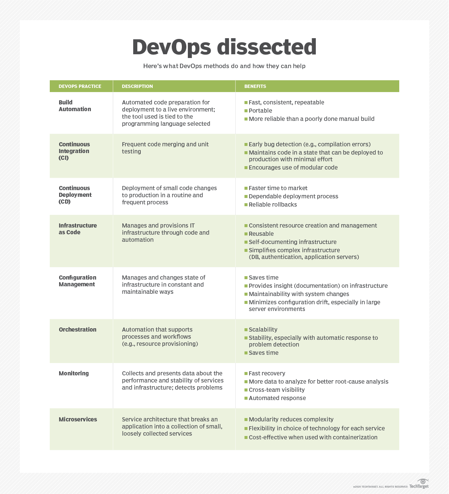

## **Devops and its Flows**

These days, there are many different perceptions on DevOps,  the most common misunderstanding about DevOps in the industry : 

DevOps in itself is Not : 
Toolset
Automation
Team
Body of knowledge
a Role
Just Automation
Innovative Framework
Silo Entity

### **What is Devops?**

DevOps is a Culture, Principle, and Process streamlining the software development and deployment lifecycle management from Source Code -> Build -> QA -> Test -> Release -> Operate -> Monitor and Maintenance.

DevOps is about removing the barriers between traditionally siloed teams, development and operations. Under a DevOps model, development and operations teams work together across the entire software application life cycle, from development and test through deployment to operations.

It is the combination of practices and tools designed to increase an organization’s ability to deliver applications and services faster than traditional software development processes. This speed enables organizations to better serve their customers and compete more effectively in the market.

### **Business benefits of Devops**

Enhanced customer experience. (ability to react and adapt in an agile way)

Increased capacity to innovate (capacity to innovate the business with lean principles)

Faster time to value (goal of DevOps is to deliver this (any) value faster and more efficiently)

Efficiency

Stability through feedback at the source.

### **How does DevOps work?**

The flow in the software development life cycle and delivery is split into 8 stages according to DevOps best practices.

### **The Life cycle of DevOps :**

The Devops process is an infinite loop, comprising these steps:

1.Plan, 2.SourceCode, 3.Build, 4.Test, 5.Release, 6.Deploy, 7.Operate, 8. Monitor
and through feedback which will resets the process loop.

##### Figure 1 image from Daniel Garay, Parasoft

**Continuous development**

**Plan** - The first step is planning and in this stage, developers/Leads/architects will be having continuous meetings and discussions with Product owners or Business owners to understand the business & product requirements.

In this phase,  the plan will be finalized and documented according to the requirements. Sample tools like Jira or Git to help track known issues and perform project management.Various DevOps projects that need to be completed by the developers. The very first phase of DevOps to continue with any further work is to know the objective of the application. 

Source Code - the coder will start the actual coding based on the requirements. Typically dev team will write code using code configuration management tool such as Git for version control. 

This is useful for maintaining the code repository among all developers in the team. Tools like GitHub, GitLab, or Bitbucket … etc to help to maintain the source code.

Build – Gather source code from different repositories and combine them to build the package code for release to production.  Tools like Gradle, Maven, Docker … will help to build the source code.

**Continuous integration**

This is the practice of being able to take a controlled version of source code from feature level branches to release level branches more frequently on a regular interval or using polling source control or at least daily or hourly into a single application, and then typically running an automated suite of tests on the resulting application.

**Test** – Perform Integration and automated testing to ensure the feedback on the quality and determine performance. Tools like cucumber, selenium, Junit, Codeception … is used to automate the testing phase and code quality.

### **Continuous testing**

Continuous Testing is the repetitive process of testing in a continuous manner to deliver superior quality applications and software. This process is part of the SDLC and begins during the creation of the initial level of development plan through the release of the final product. Continuous testing facilitates the rapid feedback of any bugs or risks associated with the release/module/product that is being developed or upgraded. This process involves the execution of automated tests as a part of the software delivery pipeline which runs separately from unit tests. Testing is the most critical step in the project development phase. Continuous testing can create immense value for businesses through a high level of integration and automation of testing and deployment. If your project is not tested and launched without any testing, then it is prone to errors and issues.

### **Continuous Delivery**

**Release** -  Continuous Delivery is an extension of continuous integration since it automatically deploys all code changes to a testing and/or production environment after the build stage. 

This the practice of ensuring source code is always in a deployable state. This means deployable entity ( new features, bug fixes, configuration changes .. etc) are always ready in an environment with appropriate approval process so that new changes are released to live production.

This means that on top of automated testing, you have an automated release process and you can deploy your application any time

### **Continuous Deployment**

**Deploy** - Continuous deployment goes one step further than continuous delivery. With this practice, every change that passes all stages of your production pipeline is released to live production. There's no human intervention, and only a failed test will prevent a new change to be deployed to production.

Jenkins, Saltstack, Chef, Ansible, Jenkins, Kubernetes, Openshift, Openstack, Docker are tools used for automating the deployment process.

**Operate** - Once the application is deployed, the operations team will perform activities such as Infrastructure changes, configuration, capacity and resource management, security check, data backup, log back up,  database management … etc.

Tools use for these functions include Ansible, Puppet, Chef, Saltstack, etc..

### **Continuous Monitoring***
Monitor - Monitoring provides feedback from production and delivers information about an application’s performance and usage patterns. When performance or other issues arise, relevant data about the issues are sent back to development teams through automated monitoring.

**Goals of Continuous Monitoring in DevOps**

Enhance transparency and visibility of IT and network operations, especially those that can trigger a security breach, and resolve it with a well-timed alert system.

Help monitor software operation, especially performance issues, identify the cause of the error, and apply appropriate solutions before significant damage to uptime and revenue.

Help track user behavior, especially right after an update to a particular site or app has been pushed to prod. This monitors if the update has a positive, negative, or neutral effect on user experience.

New Relic, Datadog, Grafana, Wireshark, Splunk, Nagios, or Slack can be use. 

### **Continuous Feedback**

Continuous feedback is the only key area which helps in providing clarity to all teams inside an organization as to what is being delivered and what issues are being reported. In DevOps, feedback is valued as important data to understand the product that has been used by the end-user.

###### 1st Disclaimer : 
###### This document is a research paper not intended for professional advice. If you need specific advice, please seek a professional who is an expert subject matter in that area.

###### Reference to any specific product or entity does not constitute an endorsement or recommendation.

### **The below diagram show each DevOps practice and its benefits**

##### Figure 2 searchitoperations.techtarget.com

###### *Note : This article is researched from numerous sources of the public domain and complied by Francis Yeo and edited by Timothy Tan using markdown for the benefit of learning for the students / trainees at SGUP-CT MSFT – Cloud Support and Devops Cohort One

###### The above is a general description of Devops and its process flow.Each Phases / Stages stated here have its own materials and detailed function description, and you should research them yourselves if you wish to find out more.

###### 2nd Disclaimer : this compilation constitutes fair-use copyright material, if any, as provided as in Section 107 of the Copyright Act US and Copyright Act, Chapter 63 of Singapore Statutes, for purposes research.
